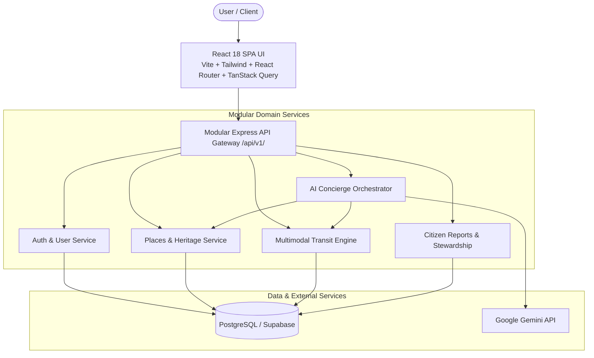

# Virasat (SIH 2026) — Target System Architecture

> [!IMPORTANT]
> **TARGET ARCHITECTURE — NOT YET IMPLEMENTED**  
> This document specifies the planned target architecture for **Virasat** per Section XII of the **Master Product & Engineering Blueprint (V2)**.  
> **Current state**: Monolithic Express server (`server.ts`) with in-memory JSON state.  
> **Target state**: Modular Express backend with PostgreSQL (Supabase), TanStack Query, and React Router, built incrementally across Phases 1–8.

---

## Architecture Overview

---

## Architectural Tiers (Target Specification)

### 1. Client Layer (React Frontend)
- **Technology**: React 18, TypeScript, Vite, Tailwind CSS, `react-router-dom`, TanStack Query.
- **Role**:
  - Interactive map exploration (Leaflet) and 3D heritage previews (Three.js).
  - Component-driven architecture using standardized UI primitives (`components/ui/`).
  - URL-first navigation and state management via TanStack Query.

### 2. Application Layer (Modular Express Backend)
- **Technology**: Node.js, Express, TypeScript.
- **Role**:
  - Versioned API gateway (`/api/v1/`) with strict input schema validation (Zod).
  - Server-side session verification, role-based access control (RBAC), and rate limiting.
  - Domain-separated service modules (`server/src/modules/*`).

### 3. Persistence Layer (PostgreSQL / Supabase)
- **Technology**: PostgreSQL (managed via Supabase or local instance).
- **Role**:
  - Persistent storage for users, places, field-level provenance facts, itineraries, favorites, and citizen heritage reports.
  - Row Level Security (RLS) for multi-tenant data isolation.

### 4. AI Grounding & Orchestration Subsystem
- **Technology**: Google Gemini (`@google/genai`) with server-side tool calling.
- **Role**:
  - Grounded conversational travel concierge.
  - Strict grounding against verified database records (tool calls to `searchPlaces`, `getTransport`, etc.).
  - Output structured JSON schemas for direct rendering into the itinerary timeline.
