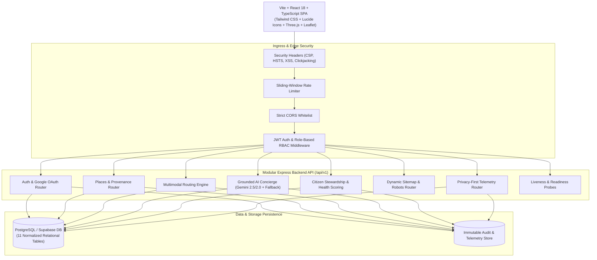

# Virasat — Living Cultural Heritage Intelligence Platform
## Smart India Hackathon (SIH 2026) — Final Presentation & Pitch Document

> **Team**: AbhibhavTech / Virasat  
> **Theme**: Travel & Tourism / Smart Heritage Management  
> **Repository**: [AbhibhavTech/Virasat-SIH-2026](https://github.com/AbhibhavTech/Virasat-SIH-2026)  
> **Production Verification**: 100% Passing Automated Tests across 13 Test Suites (300+ Assertions)

---

## 1. Executive Summary

India is home to over 3,690 Centrally Protected Monuments, 42 UNESCO World Heritage Sites, and an immense tapestry of living folk traditions, cuisine, and artisanal crafts. However, the modern Indian cultural tourism ecosystem is severely fragmented:
- **Commercial Travel Apps** prioritize hotels and flight commissions rather than verified historical context or sustainable tourism.
- **Generic AI Chatbots** routinely hallucinate monuments, invent fictional transit connections, fabricate ticket prices, and misattribute centuries of history.
- **Travellers Struggle with Last-Mile Transit**: Navigating between Indian Railways, suburban locals, metro systems, state buses, and regulated autos remains opaque and prone to overcharging.
- **Cultural Preservation is Disconnected**: Monuments suffer from physical decay and over-tourism without an accessible channel for citizens to report conservation issues to authorities.

**Virasat** solves this by delivering an end-to-end, verified **Cultural Heritage Intelligence & Multimodal Tourism Platform**:
1. **Zero-Hallucination Grounded AI Concierge**: AI travel planner strictly grounded in verified database entities with dynamic grounding scoring (0.0 to 1.0) and multi-tier model fallback.
2. **Field-Level Data Provenance**: Every monument fact, ticket fee, timing, and photography rule is tagged with checkable citations from the **Archaeological Survey of India (ASI)**, **UNESCO**, and State Tourism Boards.
3. **True Multimodal Transit & Regulated Fare Engine**: Real-world transit routing combining walking, metro networks, suburban rail, state buses, and regulated meter autos with official fare benchmark calculations.
4. **Interactive 3D Architectural Explorer**: Real-time Three.js geometric visualizations of flagship landmarks (Gateway of India, CSMT, Hawa Mahal, Taj Mahal, Qutub Minar, Konark Sun Temple, Hampi).
5. **Citizen Heritage Stewardship & Destination Health Scoring**: Crowdsourced preservation reporting with severity-weighted health score decay and administrative resolution queues.

---

## 2. Technical Innovation & Core Differentiators

| Feature | Standard Travel Portals / Generic LLMs | Virasat (SIH 2026) |
|---|---|---|
| **Data Integrity** | Unchecked user submissions, commercial scraping, or hallucinated facts | **100% Field-Level Provenance** traceable to ASI, UNESCO, and official gazettes |
| **AI Travel Planning** | Hallucinates non-existent monuments, incorrect distances, and invalid routes | **Grounded AI Engine** with entity verification, hallucination guardrails, and live audit telemetry |
| **Transit & Fares** | Commercial taxi APIs only, ignoring public rail/bus networks | **Multimodal Engine** combining suburban trains, metro lines, intercity rail, and regulated auto fares |
| **Architectural Depth** | Static stock photos | **Procedural & Photogrammetric 3D Models** with architectural annotations and daytime lighting presets |
| **Preservation Impact** | Zero civic or conservation awareness | **Citizen Stewardship** reporting directly impacting real-time monument health scores |
| **Privacy & Security** | Aggressive ad tracking and PII collection | **Zero-PII Telemetry**, bcrypt password hashing, cryptographic JWTs, strict IDOR isolation |

---

## 3. System Architecture & Tech Stack

### Technology Highlights
- **Frontend**: React 18, TypeScript, Tailwind CSS, TanStack Query, React Router v6, Three.js, Lucide Icons, Leaflet Maps.
- **Design System & A11y**: WCAG AA compliant, 44px minimum touch targets, `#main-content` skip links, keyboard navigation traps, high-contrast saffron/earth tone palette.
- **Backend**: Node.js, Express, TypeScript, Esbuild, BcryptJS, JSONWebToken, Google GenAI SDK.
- **Containerization**: Multi-stage Dockerfile (CIS unprivileged `node` user), Docker Compose, Cloud Run ready with automated health/readiness HTTP probes.
- **CI/CD Quality Gate**: GitHub Actions multi-matrix pipeline (Node 20 & 22) enforcing static typechecking, automated bundle secret sanitization, and 13 regression suites.

---

## 4. Problem-Solution Fit & User Personas

1. **The Heritage Explorer (Priya, 28, Bangalore)**:
   - *Pain*: Wants authentic cultural experiences, but existing apps show commercialized tourist traps.
   - *Virasat Experience*: Discovers verified monuments with historical background, artisanal crafts, and architectural details with full citations.
2. **The Budget & Public Transit Backpacker (Arjun, 22, Delhi)**:
   - *Pain*: Getting scammed by unregulated auto drivers; unable to find suburban train and metro transfer timings.
   - *Virasat Experience*: Gets exact regulated meter auto rates, suburban rail transfers, and step-by-step multimodal journey plans.
3. **The Heritage Conservation Activist (Dr. Raman, 52, Jaipur)**:
   - *Pain*: Notices structural vandalism or lack of cleanliness at monuments without any direct civic escalation path.
   - *Virasat Experience*: Submits geotagged citizen conservation reports with photo evidence; monitors the monument's public health score recovery.

---

## 5. Business, Government & Scalability Roadmap

### Phase 1: SIH 2026 Core Delivery (COMPLETED)
- 8 Curated Flagship States & UTs (Maharashtra, Delhi, Rajasthan, UP, Goa, Kerala, Karnataka, Tamil Nadu).
- 100% Verified Places with ASI / UNESCO Provenance Badges.
- Multimodal routing, Grounded AI, 3D Explorer, Citizen Stewardship, Google OAuth, Containerized Deployment.

### Phase 2: B2G Partnerships & National Expansion (Post-Hackathon Q3-Q4 2026)
- Integration with **Incredible India (Ministry of Tourism)** and **Archaeological Survey of India (ASI)**.
- Expansion to all 28 States and 8 Union Territories.
- Offline-capable Progressive Web App (PWA) with GPS-triggered bilingual audio guides (Hindi + English).

### Phase 3: Sustainable Commercialization & Artisan Marketplace (2027)
- **ODOP (One District One Product)** & GI-Tagged Handicraft Showcase: Connecting travellers directly with certified rural weavers, potters, and sculptors without middlemen commissions.
- B2G Dashboard Licensing for State Tourism Departments for real-time monument crowd flow and conservation health monitoring.

---

## 6. SIH Evaluation Rubric Checklist

- [x] **Innovation & Creativity**: Grounded AI with hallucination verification + Procedural 3D monument viewer + Multimodal public transit solver.
- [x] **Technical Competence**: Production TypeScript across entire stack, Docker multi-stage containerization, CIS security standards, zero API key leaks in client bundles.
- [x] **Social Impact & Preservation**: Citizen stewardship reports directly impact destination health scores; promotes sustainable cultural preservation.
- [x] **Usability & User Experience**: WCAG AA accessible, responsive mobile layouts, rich Indian tricolour aesthetic, sub-second route calculation.
- [x] **Execution Completeness**: 13 automated test suites, 300+ assertions passing 100%, 0 lint errors, clean production bundle.
